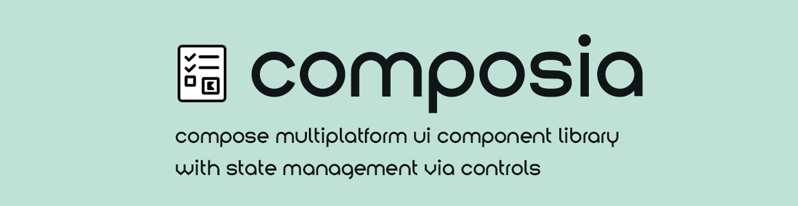

<p align="center">
    
</p>

<p align="center">


</p>

## 🌍 Поддерживаемые платформы / Supported platforms

| Платформа | Статус |
|-----------|--------|
| Windows / macOS / Linux |  ✅ Поддерживается / Supported |
| Web   |  ✅ Поддерживается / Supported |
| Android |  ✅ Поддерживается / Supported |
| iOS | ❌ Не поддерживается / Unsupported |

##### [RUS]
iOS времено не поддерживается в следствии невозможности проверить работоспособность библиотеки на данной платформе

##### [ENG]
iOS is temporarily not supported due to the impossibility of checking the functionality of the library on this platform

## 🧐 О проекте / About

##### [RUS]
**Composia - Compose Multiplatform библиотека UI-компонентов с возможностью управления их состоянием при помощи контролов.**

Библиотека состоит из 3-ех частей:
- `composia-core` — контролы (`ValidatableControl`, `ValueControl`, `StatusControl`) и валидаторы.
- `composia-ui` — готовые UI-компоненты на основе Jetpack Compose. Содержит в себе кастомные Compose компоненты как с использованием контролов, так и без них
- `composia-demo` — демонстрационная чясть библиотеки. Недоступна для подключения к своему проекту

##### [ENG]
**Composia - Compose Multiplatform library of UI components with the ability to manage their state using controls.**

The library consists of 3 parts:
- `composia-core` — controls (`ValidatableControl`, `ValueControl`, `StatusControl`) and validators.
- `composia-ui` — ready-made UI components based on Jetpack Compose. Contains custom Compose components both with and without controls
- `composia-demo` — demo part of the library. Not available for connection to your project

## 🚀 Установка / Installation

**settings.gradle.kts**

```
dependencyResolutionManagement {
    repositoriesMode.set(RepositoriesMode.FAIL_ON_PROJECT_REPOS)
    repositories {
        ...
        maven ("https://jitpack.io")
    }
}
```

**build.gradle.kts (composia-ui)**

```
dependencies {
      implementation("com.github.RavenZIP:composia-ui:$version")
      
      // Если вам не нужен UI / if you don't need a UI
      implementation("com.github.RavenZIP:composia-core:$version") 
}
```

## 🚬 Использование / Usage

Информация отсутствует

## 📜 Лицензия / License

##### [RUS]

Распространяется по лицензии Apache 2.0. Подробности смотрите в разделе [ЛИЦЕНЗИЯ](/LICENSE).

##### [ENG]

Distributed under the Apache 2.0 License. See [LICENSE](/LICENSE) for details.

## 👾 Разработчик / Developer

**Черных Александр**

- [Github](https://github.com/RavenZIP)
- [Telegram](https://t.me/RavenZIP)
